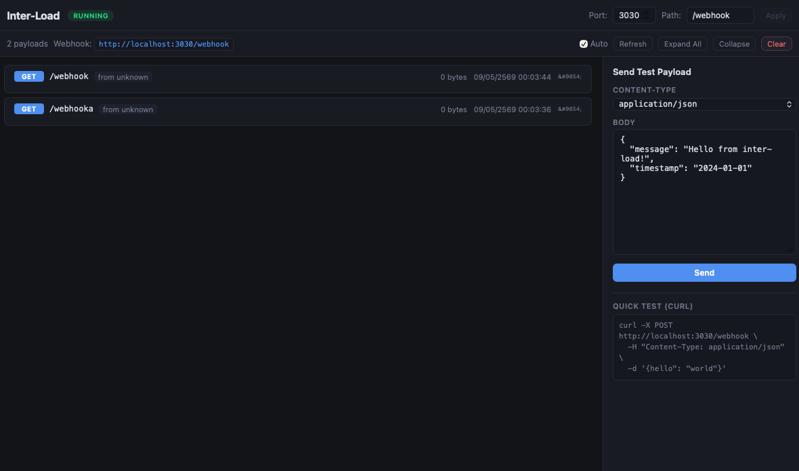

# Inter-Load



**Intercept. Inspect. Forward.**

Ever struggled with webhook integrations where you have no idea what the incoming payload looks like? No way to debug because it's server-to-server? Setting up dummy endpoints just to see the data feels like overkill?

**Inter-Load** was born from that exact frustration.

The name **Inter-Load** comes from **Intercept** + **Payload** — a tool that **intercepts incoming payloads and puts them on full display**.

---

## Why Inter-Load?

One day, I was integrating with a payment gateway that sent webhooks via POST, but I had no idea what fields were in the body, what headers were included, or where the signature lived. `console.log` was useless since it was server-to-server, not going through a browser.

Setting up an ngrok tunnel to point to localhost took forever. Creating a RequestBin meant I'd forget the URL every time.

That's when it hit me: **"Why isn't there a desktop app that just listens for everything and shows it instantly?"**

And that's how Inter-Load came to be.

---

## Features

### 1. Receive Webhooks on Any Method
The app runs a background HTTP server at `http://localhost:3030/webhook` that accepts every HTTP method — GET, POST, PUT, PATCH, DELETE. Send anything, it receives everything. No questions asked.

### 2. Full Payload Visibility
Each incoming payload is displayed as a card with:
- **HTTP Method** (POST, GET, PUT...) color-coded by type
- **Path** the request was sent to (`/webhook`, `/webhook/github`...)
- **Source IP** of the sender
- **All Headers** laid out clearly
- **Body** with Pretty / Minified / Raw toggle
- **JSON auto-format** — if it's JSON, it gets beautifully formatted
- **Timestamp** of when it was received

### 3. Visual Mapper + Forward
This is what makes Inter-Load more than just a viewer — it's a real tool.

Once you see the payload, you can forward it elsewhere with **remapped keys**:

```
Incoming payload:
{ "name": "John", "age": 30 }

Remapped to:
{ "username": "John", "user_age": 30 }

Forwarded to:
POST https://my-api.com/users
```

All done through the UI:
- Pick a key from the source → set the target key name
- Toggle individual keys on/off (checkbox)
- Add your own custom keys
- Choose HTTP method (POST, PUT, PATCH, DELETE)
- Add custom headers
- Preview the mapped payload before sending
- Save as a **Saved Rule** for reuse

### 4. Send Test Payloads
A built-in form lets you type a body and send a test payload directly — no need to open a terminal and fire curl commands.

### 5. Configurable Port & Path
- Change the port from 3030 to anything you want
- Change the webhook path from `/webhook` to `/api/callback`, `/hooks/github`, or whatever suits your setup
- Hit Apply and the server restarts instantly

---

## Tech Stack

| Layer | Technology |
|-------|-----------|
| Desktop | Tauri v2 |
| Frontend | SvelteKit + Svelte 5 |
| Backend | Rust (Axum) |
| HTTP Client | Reqwest |
| Language | TypeScript + Rust |

---

## Getting Started

```bash
# Install dependencies
bun install

# Run in dev mode
bun run tauri dev

# Build for production
bun run tauri build
```

## Testing

```bash
# Send a webhook
curl -X POST http://localhost:3030/webhook \
  -H "Content-Type: application/json" \
  -d '{"event": "payment.success", "amount": 999, "currency": "THB"}'

# Try a GET
curl http://localhost:3030/webhook

# Try a sub-path
curl -X POST http://localhost:3030/webhook/github \
  -H "Content-Type: application/json" \
  -d '{"action": "push", "ref": "refs/heads/main"}'
```

---

## Roadmap

- [ ] Auto-forward with saved rules (no manual trigger needed)
- [ ] Filter / Search payloads
- [ ] Export payloads as JSON / CSV
- [ ] Dark / Light theme toggle
- [ ] WebSocket support

---

Built with Tauri + Svelte + Rust

> Intercept the load. Understand the flow.
